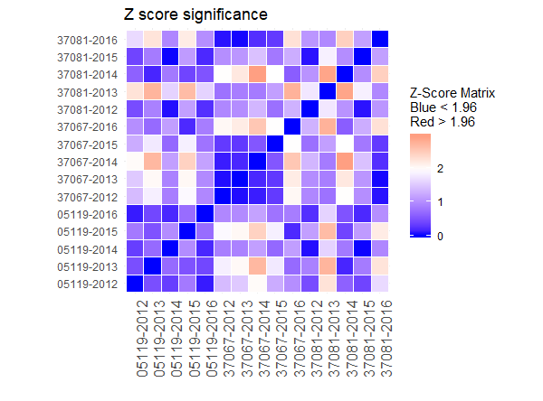

## Explanation of ACS functions

*Topics*

- [Importing data](#importing-data)
- [Calculations and significance testing](#calculations-and-significance-tests)
- [Filtering, cleaning, and wrangling](#filtering-cleaning-and-wrangling)

### Importing data

[Code file for import functions](acs_functions_import.R)

_____

```{r}
ff_import_acs(table_number, state, county=NULL, year_start, year_end, acs_data=NULL)
```

This function returns a table for multiple geographic units (county and state combinations) and years.

Parameters:
- table_number: The ACS table number for the data that is needed. This imports all tables in a series. For example, 'B20017' imports 'B20017A', 'B20017B', 'etc.
- state: A vector of strings for the states, which should match with counties.
- county: A vector of strings for the counties, which should match with the states.
          If only state level data is needed enter `NULL`.
- year_start: an integer specifying the first year of data that is needed. Must be at least 2012.
- year_end: an integer specifying the final year of data that is needed.
- acs_data: ACS survey (example: 'acs1', 'acs5')
            Default value is 'acs1'

The function returns 95% confidence intervals for the margin of error. This is different than the default value of data retried from American Fact Finder. 

The function also calculates and returns the standard error in the column `se`. The standard error is derived by dividing the marging of error by 1.96. 1.96 is used because the margin of error is at the 95% level.

The coefficient of variartion (cv) is also calculated and returned under the `cv` column. It is derived by dividing the standard error by the estimate. Within the function, this number **is not** converted to a percentile by multiplying by 100.

*Example*
```{r}

# for county data
acs_df <- ff_import_acs(table_number = 'B20017', 
                        state = c('NC', 'NC', 'AR'),
                        county = c('Forsyth', 'Guilford', 'Pulaski'),
                        year_start = 2012,
                        year_end = 2016.
                        acs_data = 'acs1')
                        
# for state data
acs_df <- ff_import_acs(table_number = 'B20017', 
                        state = 'NC',
                        county = NULL,
                        year_start = 2012,
                        year_end = 2016,
                        acs_data = 'acs1')

```


_____

[back to top](#explanation-of-acs-functions)

### Calculations and significance tests

[Code file for calculations and significance testing functions](acs_functions_test.R)

_____

```{r}
ff_acs_zscore(data_frame, estimate, se, var_names = NULL)
```

This function returns a square symmetrical matrix of z scores for all combinations of values within the data set. The matrix length and with equal the number of rows in the data frame.

The formula comes from: U.S. Census Bureau, A Compass for Understanding and Using ACS Survey Data, A-18 (October 2008)

Parameters:
- data_frame: the data frame where the estimates and standard errors are housed
- estimate: a string that is the column name of the column containing the estimate
- se: a string that is the column name of the column containing the standard error
- var_names: (optional) a character vector of variables that can be combined to created distinct names for each row and column

`var_names` is optional. It aids in interpreting the matrix by assigning names to the rows and columns. This way, users can more easily trace a specific z-score to which two values created the score.

*Example*
```{r}
zscore <- ff_acs_zscore(data_frame = acs_df,
                        estimate = 'estimate', 
                        se = 'se', 
                        var_names = c('GEOID', 'varable', 'year'))
```

_____

```{r}
ff_acs_zplot(zscore_matrix)
```

This function returns a plot similar to a correlation plot, showing whether z values are significant. Z scores over 1.96 are significant, which corresponds to a p-value of 0.05 or less. Red values are statistically significant, blue values are not.

The function's input is a z sore matrix generated from `ff_acs_zscore`.

*Example*
```{r}
ff_acs_zplot(zscore_matrix = zscore)
```
Here is an example of the output:



_____


```{r}
ff_acs_ratios(df, num_estimate, num_moe, den_estimate, den_moe)
```

This function calculates the ratio, standard error, and 95% margins of error for user derived ratios. The formula comes from: U.S. Census Bureau, A Compass for Understanding and Using ACS Survey Data, A-15 (October 2008).

Parameters:
- df: an ACS data frame created by `ff_import_acs`
- num_estimate: the column names for the numerator for the ratio as a string
- num_moe: the column names for the 95% margin of error for the numerator as a string
- den_estimate: the column names for the denominator for the ratio as a string
- den_moe: the column names for the 95% margin of error for the denominator as a string

The function's output is the same data frame with three columns added:
- ratio: The point estimate for the ratio
- ratio_moe: The 95% margin of error for the ratio
- ratio_se: The standard error for the ratio

*Example*
```{r}
gender_inequality_income <- ff_acs_ratios(df = gender_inequality_sex, 
                                          num_estimate = 'f_estimate', 
                                          num_moe = 'f_moe', 
                                          den_estimate = 'm_estimate',
                                          den_moe = 'm_moe')
```

_____

[back to top](#explanation-of-acs-functions)

### Filtering, cleaning, and wrangling

[Code file for filtering, cleaning, and wrangling functions](acs_functions_wrangle.R)

_____

```{r}
ff_acs_ethnicity(df)
```

This function removes ethnicities from an ACS data set that are not regularly used due to a lack of data. Its input is an ACS data frame created by `ff_import_acs`.

The following ACS ethnicities are retained:
- ALL
- BLACK OR AFRICAN AMERICAN ALONE
- WHITE ALONE, NOT HISPANIC OR LATINO
- HISPANIC OR LATINO

*Example*
```{r}
df_ethnicities <- ff_acs_ethnicity(df = acs_df)
```

_____

```{r}
ff_acs_keep_vars(df, variables)
```
  
This function filters for specific variables. The variables are the three digit numbers that are shown as the last three digits in the 'variables' column. Input includes the data frame of ACS data and the variables that are needed variables are entered as a three digit string (ex: '001').

Important: variables must be entered as strings.

Parameters:
- df: an ACS data frame created by `ff_import_acs`
- variables: a string vector of variables to retain

*Example*
```{r}
df_vars <- ff_acs_keep_vars(df = df_ethnicities,
                            variables = c('001', '003', '007'))
```

_____


    
